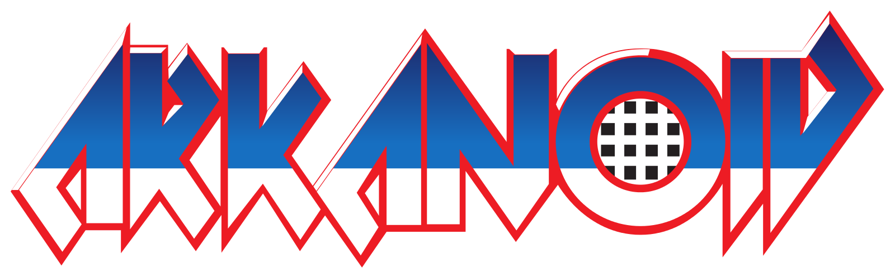
#  Arkanoid (Brick Breaker) 🕹️

# Содержание
- [Установка и запуск](#установка-и-запуск-🛠️)
- [Стэк](#стэк-💻)
- [Реализация](#реализация-📝)
- [Как написать свою игру](#инициализация-игры)

### Игра из прошлого — мечта в настоящем

> Arkanoid — видеоигра для игровых автоматов, разработанная компанией Taito в 1986 году. Игра основана на играх серии Breakout фирмы Atari. Именно её название стало нарицательным для класса подобных игр.

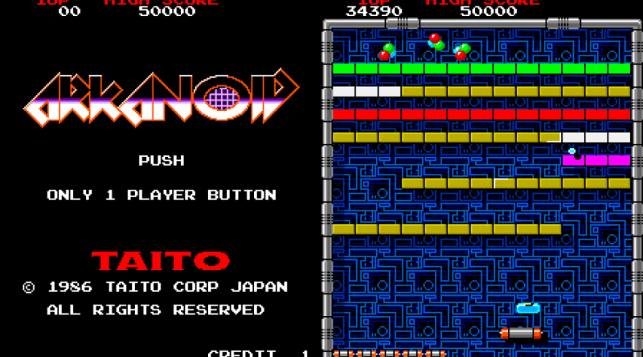

> Игрок контролирует небольшую платформу-ракетку, которую можно передвигать горизонтально от одной стенки до другой, подставляя её под шарик, предотвращая его падение вниз. Удар шарика по кирпичу приводит к разрушению кирпича. После того как все кирпичи на данном уровне уничтожены, происходит переход на следующий уровень, с новым набором кирпичей.


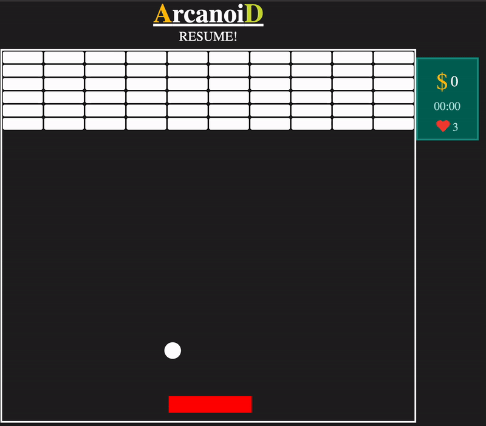

## Установка и запуск 🛠️
1. Клонируйте репозиторий: `git clone https://github.com/Aibekabdi/brick-breaker.git`
2. Перейдите в директорию проекта: `cd brick-braker`
3. Запустите проект с помощью команды: `go run .`
4. Откройте браузер и перейдите по адресу: http://localhost:8080

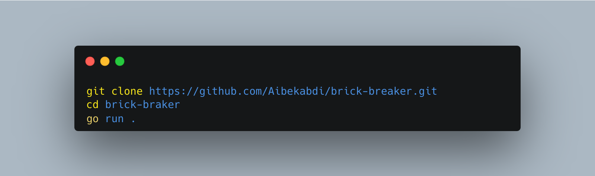

## Стэк 💻

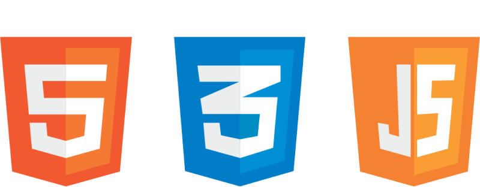

Да, всё действительно так. Для данного проекта требуется знать всего лишь HTML/CSS и JavaScript. Ничего больше не требуется 😁

## Реализация 📝

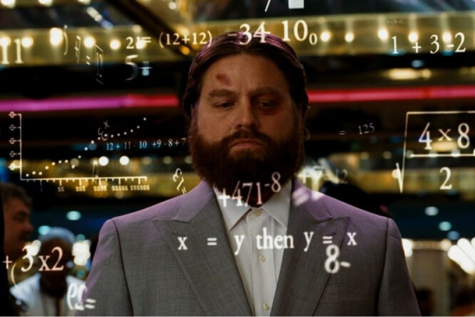

Игра запускается в главном HTML-файле (index.html) и предоставляет пользователю интерактивное игровое поле, заполненное кирпичами, шариком и платформой-ракетой.

### Инициализация игры
Перед загрузкой сайта происходит заполнение игрового поля (обозначенного в HTML, например, как ```<div id="field">```) необходимыми элементами, такими как кирпичи, шар и платформа-ракета.

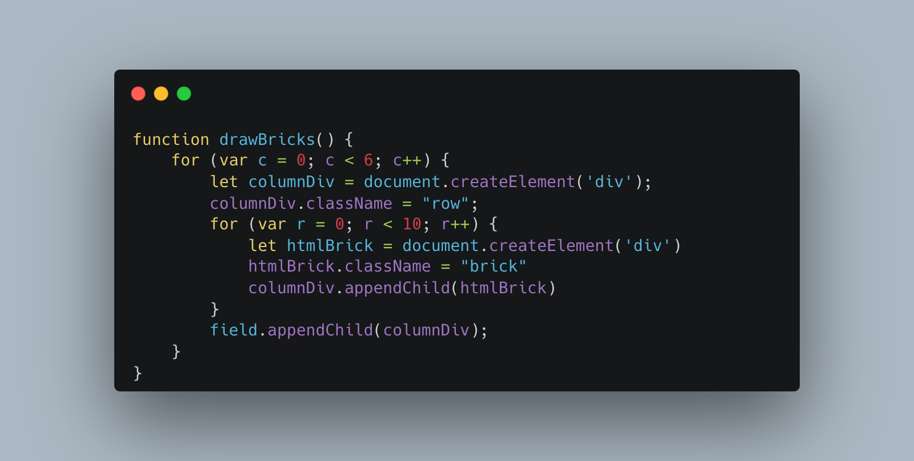

### Основная логика игры
Основной код включает функцию, отвечающую за логику игры. В этой функции реализовано движение объектов, включая шар, и их взаимодействие с краями поля, кирпичами и платформой. При ударе шара о стены или кирпичи происходит изменение направления его движения.

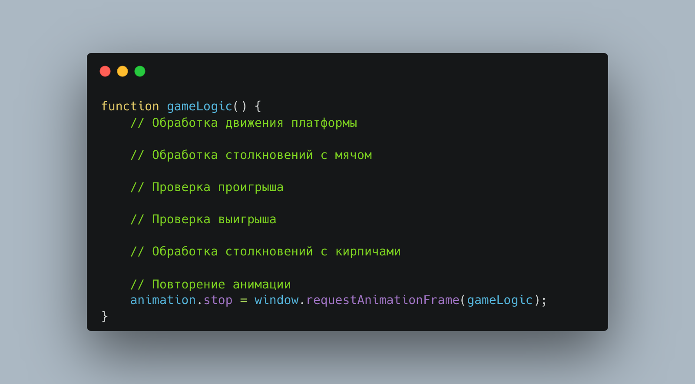

### Управление платформой-ракетой
Пользователь может управлять платформой-ракетой, перемещая ее влево и вправо. Это обеспечивает интерактивность игры и позволяет пользователю влиять на направление движения шара.

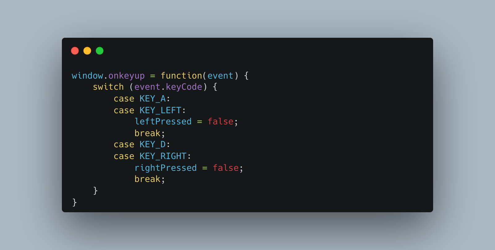

### Запуск игры
Игра запускается с использованием функции, которая обрабатывает основную логику игры по кадрам. Для этого используется requestAnimationFrame(gameLogic), что обеспечивает плавное выполнение игровой логики.

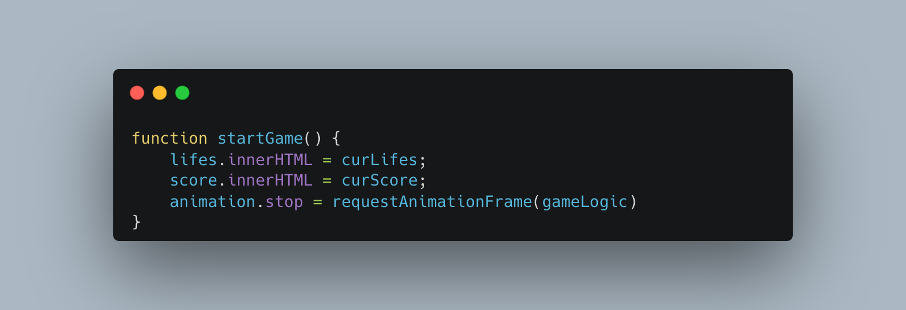

### Дополнительные функциональности
Счетчик и табло: Реализован счетчик для отслеживания набранных очков.
Жизни: Игра включает в себя механизм жизней, отображающий оставшиеся попытки перед поражением.
Пауза: Добавлена функциональность паузы, позволяющая приостановить игру в любой момент.

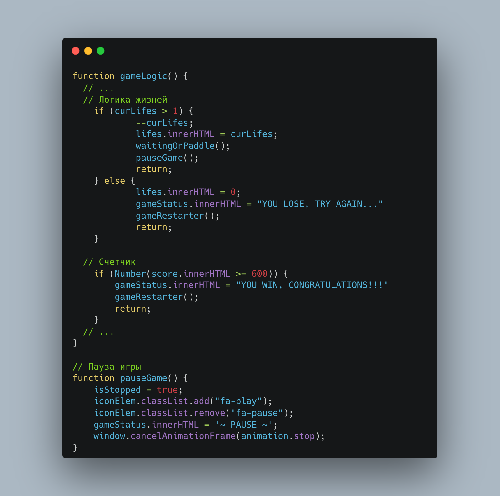

## Как написать свою игру схожую по сложности на Arcanoid? 🎮👾

#### Перед тем, как начать разрабатывать свою игру, выберите игру из списка или по сложности схожую игру:
- Bomberman
- Flipper/ Pinball
- Space Invaders
- Donkey Kong
- Brick Breaker/ Arkanoid
- Pac-Man
- Super Mario
- Tetris
- Duck Hunt

#### Изучение игры:
- Что это за игра?
- Какие основные механики в игре?
- Какие подводные камни существуют?

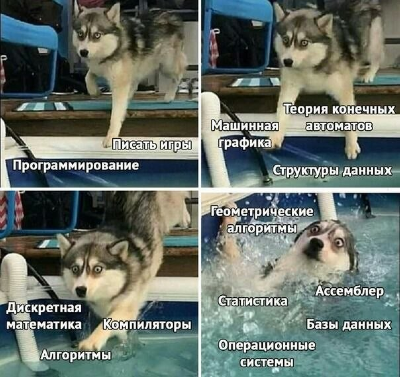

#### Изучение разработки игр на JS:
- Как создаются игры на JS без фреймворков?
- Как обычно происходит управление в играх на JS?

#### Составление плана:
- Как начать разработку?
- Нарисовать площади игры (квадратик).
- Заполнение площади объектами (стены, пол, боты, персонаж пользователя).
- Написание управления для пользователя.

#### Бонус:
- Разработка логики для бота.
- Рандомное появление ботов.