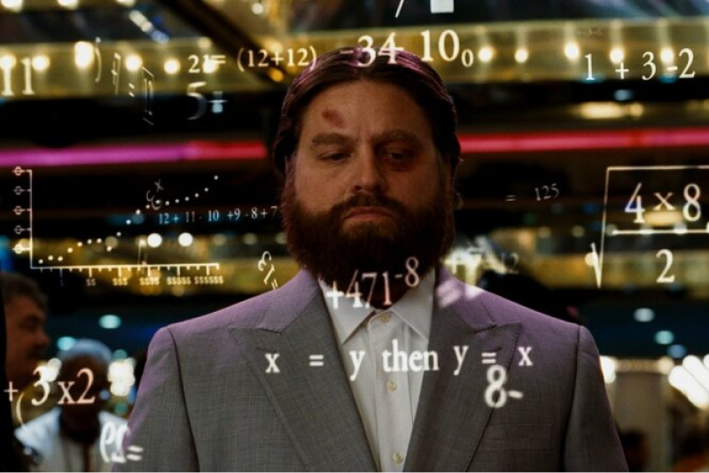

# Make-your-game (Arkanoid)
## Игра из прошлого, интегрированная в настоящее

### Описание
> Arkanoid — видеоигра для игровых автоматов, разработанная компанией Taito в 1986 году. Игра основана на играх серии Breakout фирмы Atari. Именно её название стало нарицательным для класса подобных игр.

> Игрок контролирует небольшую платформу-ракетку, которую можно передвигать горизонтально от одной стенки до другой, подставляя её под шарик, предотвращая его падение вниз. Удар шарика по кирпичу приводит к разрушению кирпича. После того как все кирпичи на данном уровне уничтожены, происходит переход на следующий уровень, с новым набором кирпичей.

Игрок контролирует небольшую платформу-ракетку, которую можно передвигать горизонтально от одной стенки до другой, подставляя её под шарик, предотвращая его падение вниз. Удар шарика по кирпичу приводит к разрушению кирпича. После того как все кирпичи на данном уровне уничтожены, происходит переход на следующий уровень, с новым набором кирпичей.

